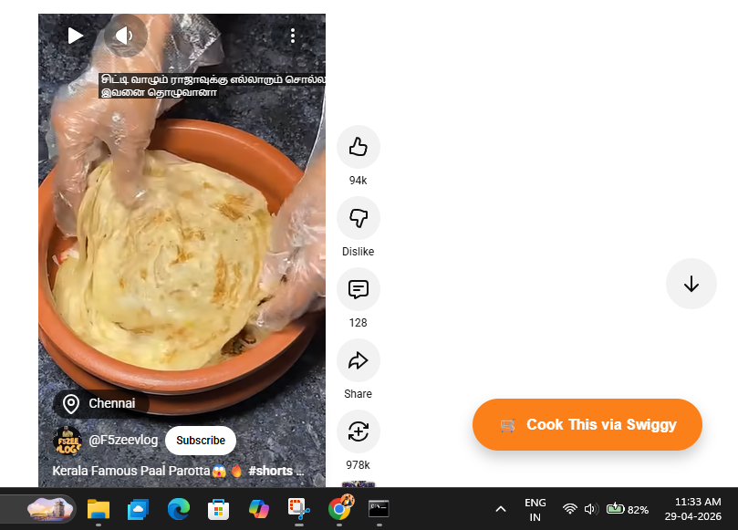

# 🛒 Recipe-to-Reality: Swiggy MCP AI Agent

**Transforming YouTube recipes into instant Swiggy Instamart carts using AI.**

---

## 🚀 Overview
**Recipe-to-Reality** is an AI-native extension designed for the **Swiggy Builders Club 2026**. It eliminates the friction between watching a cooking tutorial and actually buying the ingredients. 

Using Gemini 1.5 Pro to parse video transcripts, it autonomously maps ingredients to available SKUs via the **Swiggy MCP (Model Context Protocol) APIs**, building a complete Instamart cart in a single click.

### 📸 Demonstration (Working Prototype)
Here is the 'Recipe-to-Reality' extension active on a YouTube Shorts video:

## ✨ Key Features
*   **Context-Aware Injection:** Automatically detects recipe videos and shorts on YouTube to show the "Cook This" button.
*   **AI Ingredient Extraction:** Leverages Gemini to turn natural language video descriptions into structured shopping lists.
*   **Autonomous Cart Building:** Uses the Swiggy Instamart MCP server to search and add items to a user's session.
*   **One-Click Fulfillment:** Secure handoff to the Swiggy checkout page for final payment.

## 🛠️ Tech Stack
*   **Frontend:** Chrome Extension (Manifest V3)
*   **Backend:** Python (FastAPI) 
*   **AI Model:** Gemini 1.5 Pro (via AWS Bedrock)
*   **Protocol:** Model Context Protocol (MCP)

## 📂 Project Structure
*   `manifest.json`: Extension configuration.
*   `content.js`: Logic for YouTube button injection and URL capturing.
*   `styles.css`: Signature Swiggy-themed UI styling.

---
*Created for the Swiggy Builders Club Application.*
